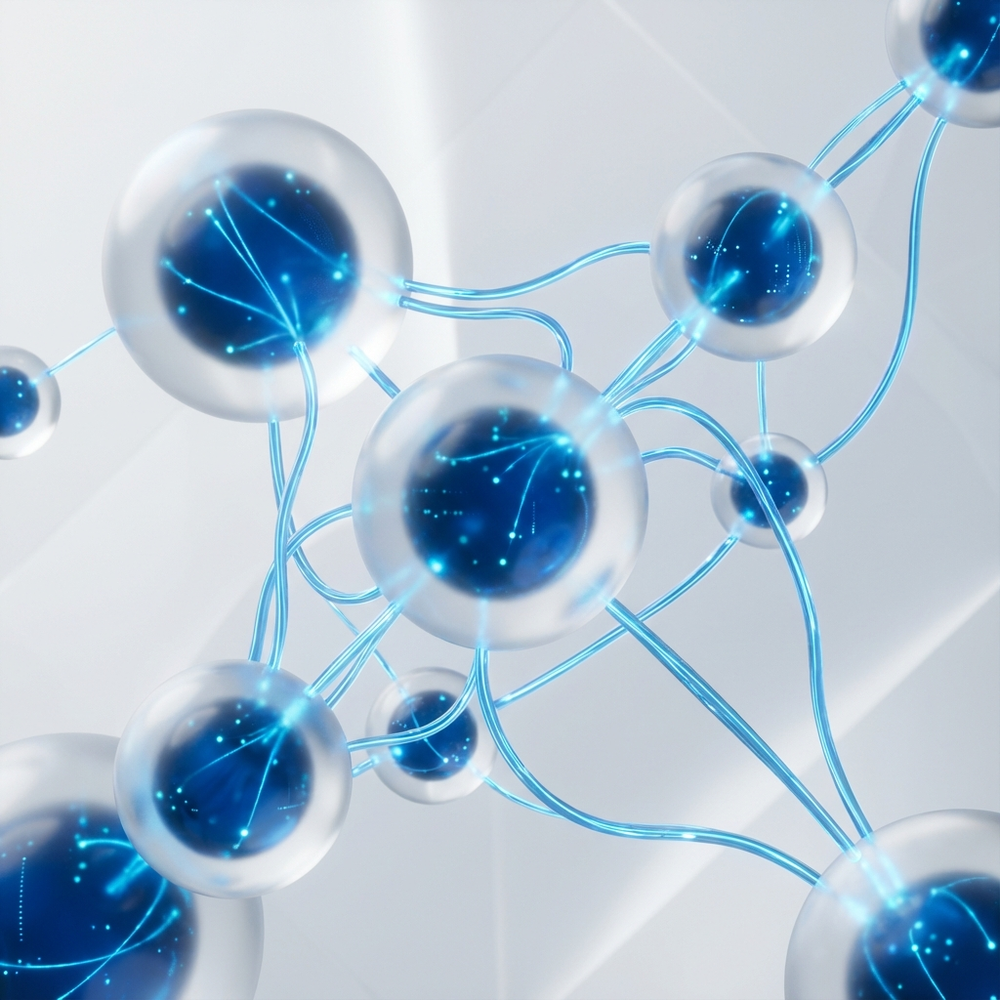

# 🚀 IdsCraft Agency Website



> **Une vitrine digitale premium pour une agence d'automatisation et de développement moderne.**
> 
> *Stack: Next.js 14, Tailwind CSS, TypeScript, Framer Motion.*

## 📋 À Propos

**IdsCraft** est le site vitrine d'une agence digitale "Fullstack Moderne". Le projet a été conçu avec une attention particulière portée au design (UI/UX), à la fluidité des animations et à la performance.
L'objectif est de convertir les visiteurs en prospects qualifiés grâce à une présentation claire des services (Web, Mobile, IA, Auto) et un portfolio interactif.

### ✨ Fonctionnalités Clés

- 🎨 **Design Premium & "Warm"** : Interface épurée, gradients subtils, glassmorphism.
- 🌗 **Dark Mode Support** : Thème sombre élégant intégré nativement.
- 📱 **100% Responsive** : Mobile-first, menu burger animé.
- ⚡ **Animations** : Transitions de pages et micro-interactions fluides (Framer Motion).
- 🧩 **Architecture Modulaire** : Basé sur des composants réutilisables (Shadcn/ui).
- 🔍 **SEO Ready** : Structure sémantique et métadonnées optimisées.

---

## 🛠️ Stack Technique

Ce projet utilise les dernières technologies du web moderne :

- **Framework** : [Next.js 14](https://nextjs.org/) (App Router)
- **Langage** : [TypeScript](https://www.typescriptlang.org/)
- **Style** : [Tailwind CSS](https://tailwindcss.com/)
- **Composants UI** : [Shadcn/ui](https://ui.shadcn.com/) (Radix Primitives)
- **Animations** : [Framer Motion](https://www.framer.com/motion/)
- **Icônes** : [Lucide React](https://lucide.dev/)
- **Gestion de Thème** : `next-themes`

---

## 🚀 Installation & Démarrage

### Pré-requis

- Node.js 18+
- npm ou bun

### 1. Cloner le projet

```bash
git clone https://github.com/votre-username/idscraft.git
cd idscraft
```

### 2. Installer les dépendances

```bash
npm install
# ou
bun install
```

### 3. Lancer le serveur de développement

```bash
npm run dev
```

Ouvrez [http://localhost:3000](http://localhost:3000) dans votre navigateur.

---

## 📂 Structure du Projet

```bash
idscraft/
├── app/                  # Pages et Layouts (Next.js App Router)
│   ├── a-propos/         # Page À Propos
│   ├── book/             # Page de Réservation
│   ├── portfolio/        # Page Portfolio
│   ├── services/         # Page Services
│   ├── globals.css       # Styles globaux & Variables CSS
│   ├── layout.tsx        # Layout Racine (Font, Providers)
│   └── page.tsx          # Page d'accueil
├── components/           # Composants React
│   ├── home/             # Composants spécifiques à la Home (Hero, Trust...)
│   ├── layout/           # Navbar, Footer
│   ├── ui/               # Composants de base (Button, Card, Badge...)
│   └── theme-toggle.tsx  # Bouton switch Dark/Light
├── lib/                  # Utilitaires (cn, fetching...)
├── public/               # Assets statiques (Images, SVG)
└── ...config files       # Tailwind, TSConfig, Next Config
```

---

## 🎨 Personnalisation

### Couleurs
Les couleurs sont définies via des variables CSS dans `app/globals.css`.
Le thème principal utilise une teinte **Deep Blue** (`sky-500` variant).

### Logo
Le logo utilise un composant dédié `components/ui/logo.tsx` pour une performance optimale et éviter les soucis de loader SVG.

---

## 🤝 Contribuer

Les contributions sont les bienvenues ! Pour des changements majeurs, veuillez ouvrir une issue d'abord pour discuter de ce que vous aimeriez changer.

1. Fork le projet
2. Créer une branche (`git checkout -b feature/AmazingFeature`)
3. Commit les changements (`git commit -m 'Add some AmazingFeature'`)
4. Push sur la branche (`git push origin feature/AmazingFeature`)
5. Ouvrir une Pull Request

---

## 📄 Licence

Distribué sous la licence MIT. Voir `LICENSE` pour plus d'informations.
